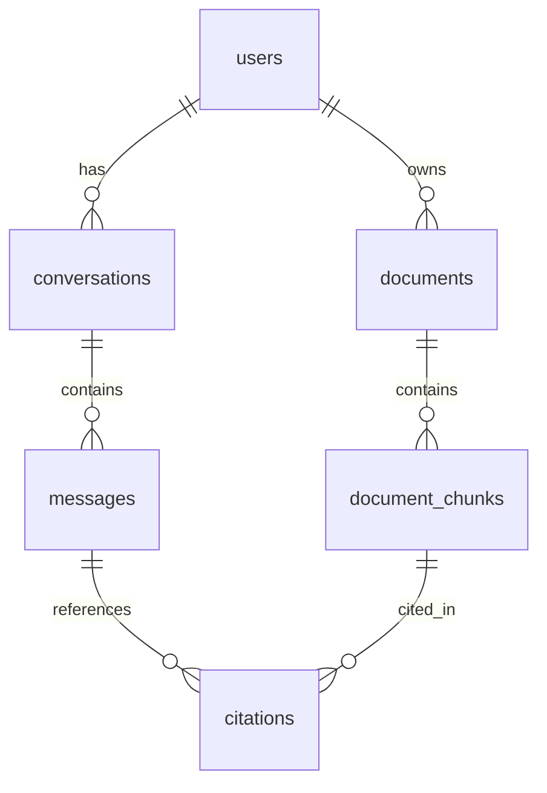

# Supabase Database Schema Documentation

## Overview
This document outlines the database schema for the document chat application, including tables, relationships, and security policies.

## Tables

### 1. Documents
Stores information about uploaded documents.

```sql
CREATE TABLE documents (
  id UUID PRIMARY KEY DEFAULT gen_random_uuid(),
  user_id UUID NOT NULL REFERENCES auth.users(id) ON DELETE CASCADE,
  name TEXT NOT NULL,
  file_path TEXT NOT NULL,
  status TEXT NOT NULL DEFAULT 'pending' 
    CHECK (status IN ('pending', 'processing', 'completed', 'failed')),
  created_at TIMESTAMPTZ DEFAULT now(),
  updated_at TIMESTAMPTZ DEFAULT now(),
  file_size INTEGER NOT NULL,
  mime_type TEXT NOT NULL,
  error_message TEXT
);
```

**Security Policies:**
- Users can only read their own documents
- Users can only insert their own documents
- Users can only update their own documents
- Users can only delete their own documents

### 2. Document Chunks
Stores text chunks from documents with vector embeddings for similarity search.

```sql
CREATE TABLE document_chunks (
  id UUID PRIMARY KEY DEFAULT gen_random_uuid(),
  document_id UUID NOT NULL REFERENCES documents(id) ON DELETE CASCADE,
  content TEXT NOT NULL,
  embedding VECTOR(1536), -- OpenAI embeddings dimension
  chunk_index INTEGER NOT NULL,
  created_at TIMESTAMPTZ DEFAULT now()
);
```

**Indexes:**
- `document_chunks_embedding_idx`: IVFFlat index for vector similarity search

**Security Policies:**
- Users can only access chunks from their own documents
- All operations (SELECT, INSERT, UPDATE, DELETE) are restricted to document owners

### 3. Conversations
Stores chat conversations between users and the AI.

```sql
CREATE TABLE conversations (
  id UUID PRIMARY KEY DEFAULT gen_random_uuid(),
  user_id UUID NOT NULL REFERENCES auth.users(id) ON DELETE CASCADE,
  title TEXT NOT NULL,
  created_at TIMESTAMPTZ DEFAULT now(),
  updated_at TIMESTAMPTZ DEFAULT now()
);
```

**Security Policies:**
- Users can only read their own conversations
- Users can only create conversations for themselves
- Users can only update their own conversations
- Users can only delete their own conversations

### 4. Messages
Stores individual messages within conversations.

```sql
CREATE TABLE messages (
  id UUID PRIMARY KEY DEFAULT gen_random_uuid(),
  conversation_id UUID NOT NULL REFERENCES conversations(id) ON DELETE CASCADE,
  role TEXT NOT NULL CHECK (role IN ('user', 'assistant')),
  content TEXT NOT NULL,
  created_at TIMESTAMPTZ DEFAULT now()
);
```

**Security Policies:**
- Users can only access messages from their own conversations
- All operations are restricted to conversation owners

### 5. Citations
Stores references to document chunks used in AI responses.

```sql
CREATE TABLE citations (
  id UUID PRIMARY KEY DEFAULT gen_random_uuid(),
  message_id UUID NOT NULL REFERENCES messages(id) ON DELETE CASCADE,
  document_id UUID NOT NULL REFERENCES documents(id) ON DELETE CASCADE,
  chunk_id UUID NOT NULL REFERENCES document_chunks(id) ON DELETE CASCADE,
  start_char INTEGER NOT NULL,
  end_char INTEGER NOT NULL,
  created_at TIMESTAMPTZ DEFAULT now()
);
```

**Security Policies:**
- Users can only access citations from their own messages
- All operations are restricted to message owners

## Functions

### match_documents
Function for performing similarity search on document chunks.

```sql
CREATE OR REPLACE FUNCTION match_documents(
  query_embedding VECTOR(1536),
  match_threshold FLOAT,
  match_count INT,
  user_id UUID
)
RETURNS TABLE (
  id UUID,
  document_id UUID,
  content TEXT,
  similarity FLOAT
)
```

**Parameters:**
- `query_embedding`: Vector embedding of the search query
- `match_threshold`: Minimum similarity score (0-1)
- `match_count`: Maximum number of results to return
- `user_id`: User ID for filtering results

**Returns:**
- Matching document chunks with similarity scores
- Only returns chunks from documents owned by the specified user

## Extensions

- `vector`: Used for storing and querying vector embeddings
- `pgvector`: Required for vector similarity search operations

## Security

All tables have Row Level Security (RLS) enabled with policies that ensure:
1. Users can only access their own data
2. All operations are authenticated
3. Data is properly isolated between users
4. Cascading deletes maintain referential integrity

## Relationships



## Usage Examples

### 1. Creating a New Document
```sql
INSERT INTO documents (user_id, name, file_path, file_size, mime_type)
VALUES ('user_uuid', 'document.pdf', 'path/to/file.pdf', 1024, 'application/pdf');
```

### 2. Searching Similar Content
```sql
SELECT * FROM match_documents(
  '[0.1, 0.2, ...]'::vector(1536),
  0.7,
  5,
  'user_uuid'
);
```

### 3. Creating a Conversation
```sql
INSERT INTO conversations (user_id, title)
VALUES ('user_uuid', 'New Chat')
RETURNING id;
```

### 4. Adding a Message
```sql
INSERT INTO messages (conversation_id, role, content)
VALUES ('conversation_uuid', 'user', 'Hello, AI!');
```

## Maintenance

### Backup
```bash
make backup
```

### Restore
```bash
make restore
```

### Type Generation
```bash
make types
```

## Migration Management

See the Makefile for available migration commands:
- `make migrate-new`: Create new migration
- `make migrate-up`: Apply pending migrations
- `make migrate-down`: Rollback last migration
- `make migrate-reset`: Reset all migrations
- `make db-status`: Check migration status 